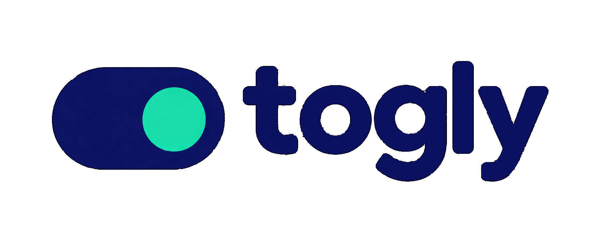

<p align="center">
  

  <h2 align="center">Togly Portal</h2>
  <p align="center">
    An administration portal for managing feature flags and reviewing audit history
  </p>
</p>

---

## Overview

**Togly** is the centralized feature-flag service for the Linden platform. The **Togly Portal** provides an administration interface for managing feature flags and reviewing their history.

The portal acts as a client of the Togly API rather than implementing feature-flag logic locally. This keeps feature-flag configuration and evaluation centralized within the Togly service.

### Core Responsibilities

- **Feature Flag Management** to create, update, enable, disable, and manage feature flags
- **Audit History** to review changes made to feature flags over time
- **Togly API Integration** to communicate with the centralized Togly service
- **Administration Interface** to provide a clear and consistent interface for managing feature-flag configuration
- **Centralized Configuration** to ensure feature-flag logic and state remain managed by Togly rather than the portal itself

## Getting Started

### Prerequisites

- **Node.js**: Version 22.21.1
- **Package Manager**: bun 1.3.5

### Installation

1. **Clone the repository**

   ```bash
   git clone <repository-url>
   cd togly-portal
   ```

2. **Set up environment variables**

   Create a `.env` file in the root directory with the following variables:

   ```env
   # Auth0 Configuration
   AUTH0_CLIENT_ID=your_auth0_client_id
   AUTH0_DOMAIN=your_auth0_domain
   AUTH0_AUDIENCE=your_auth0_audience
   AUTH0_ORGANIZATION_ID=your_auth0_organization_id

   # Application Configuration
   HOST_URL=http://localhost:3000
   NODE_ENV=development

   # Togly API
   TOGLY_API_URL=https://api.example.com
   ```

3. **Install dependencies**

   ```bash
   bun install
   ```

4. **Run the development server**

   ```bash
   bun run dev
   ```

5. **Open your browser**

   Navigate to http://localhost:3000 to view the application.

### Run with Docker

1. **Build the image**

   ```bash
   docker build -t togly-portal .
   ```

2. **Run the container**

   ```bash
   docker run -p 3000:3000 togly-portal:latest
   ```

### Production Build

1. **Build the application**

   ```bash
   bun run build
   ```

2. **Start the production server**

   ```bash
   bun run start
   ```

### Available Scripts

- `dev` - Start the development server
- `build` - Build the application for production
- `start` - Start the production server
- `lint` - Run ESLint for code linting
- `typecheck` - Run TypeScript type checking
- `format` - Format code with Prettier

### Development Notes

- The application uses Vite for fast development builds and hot module replacement
- TypeScript is configured for strict type checking
- ESLint and Prettier are configured for consistent code formatting
- The app includes internationalization support with i18next
- Authentication is handled through Auth0 integration
- Feature flags are managed through the Togly API
- The portal does not implement feature-flag evaluation or business logic locally
- Audit history is retrieved from the Togly API
